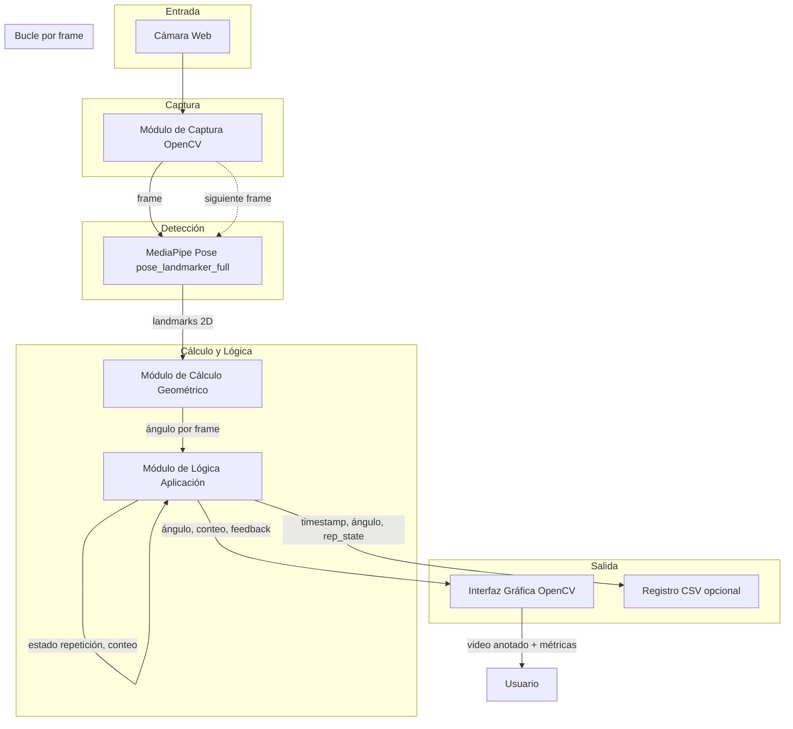
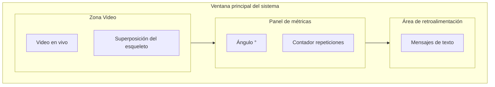

# Anexo C: Diagramas de Arquitectura y Bocetos de Interfaz (Wireframes)

Este anexo complementa la descripción del Capítulo 5 con un diagrama de flujo detallado del *pipeline* de procesamiento y bocetos de baja fidelidad de la interfaz gráfica.

---

## 1. Diagrama de flujo del *pipeline* de procesamiento

El sistema procesa cada *frame* de video en un bucle continuo. El flujo sigue la arquitectura modular descrita en el Cap. 5: captura → detección de pose → cálculo geométrico y lógica de aplicación → visualización y, opcionalmente, registro en CSV.

**Leyenda:**

- **Entrada:** Flujo de video desde la cámara web (720p o superior).
- **Captura:** OpenCV lee *frames* y los entrega al siguiente módulo.
- **Detección:** MediaPipe obtiene las coordenadas 2D de los 33 *landmarks* (hombro, codo, cadera, etc.).
- **Cálculo y lógica:** A partir de los *landmarks*, se calcula el ángulo de abducción (cadera–hombro–codo) y una máquina de estados determina el ciclo de movimiento (subida/bajada) y el conteo de repeticiones válidas.
- **Salida:** La GUI muestra el video con el esqueleto superpuesto, el ángulo, el contador y los mensajes de retroalimentación. Opcionalmente, se escribe en CSV (timestamp, coordenadas, ángulo, estado de repetición) para análisis posterior.

---

## 2. Wireframes de la interfaz gráfica principal

Bocetos de baja fidelidad que describen la disposición de los elementos en la ventana principal del prototipo.

### 2.1. Descripción por zonas

| **Zona** | **Contenido** |
| :--- | :--- |
| **Ventana de video** | Área principal donde se muestra el video en vivo de la cámara. Ocupa la mayor parte de la pantalla. Sobre el video se dibuja la superposición del esqueleto: *landmarks* (puntos) y segmentos que unen hombro–codo, hombro–cadera, etc., conforme a la detección de MediaPipe. |
| **Panel de métricas en tiempo real** | Región fija (p. ej. esquina superior izquierda o barra lateral) que muestra: (a) el **ángulo** actual de abducción del hombro en grados (°); (b) el **contador** de repeticiones válidas completadas en la sesión. Valores actualizados *frame* a *frame*. |
| **Área de mensajes de retroalimentación** | Zona dedicada a mensajes de texto que guían al usuario: por ejemplo, "Extienda más el brazo", "Repetición válida", "Baje el brazo para completar". Puede situarse debajo del video o en un panel lateral. El color o el estilo del texto pueden variar según el tipo de mensaje (correcto, advertencia, etc.). |

### 2.2. Esquema de disposición

El siguiente diagrama representa la distribución de las regiones en la ventana principal.

**Disposición sugerida:**

- **Arriba o lateral:** Panel de métricas (ángulo + contador).
- **Centro:** Ventana de video con esqueleto superpuesto.
- **Abajo o lateral:** Área de mensajes de retroalimentación.

La implementación concreta (OpenCV) puede usar *overlays* de texto y rectángulos para delimitar las zonas, manteniendo siempre visibles las cuatro componentes: video, esqueleto, métricas y mensajes.
