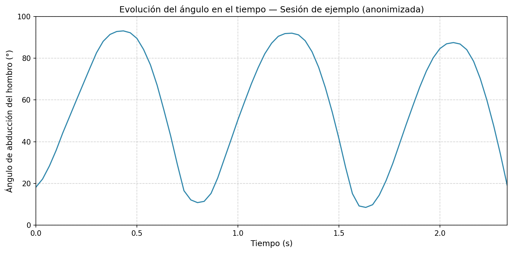

# Anexo E: Ejemplos de Salida del Sistema y Datos Crudos (Anonimizados)

Muestra representativa y anonimizada de los datos generados por el prototipo, destinada a ilustrar su funcionamiento. Se incluyen: (1) descripción y esquema de la captura de pantalla del sistema, (2) extracto de un log CSV y (3) un gráfico de evolución del ángulo en el tiempo.

---

## 1. Captura de pantalla del sistema en funcionamiento

Durante una repetición de elevación lateral del brazo, la ventana principal del sistema muestra:

- **Video en vivo** de la cámara web con el **esqueleto superpuesto**: puntos (*landmarks*) en hombro, codo, cadera y segmentos que los unen, según la detección de MediaPipe.
- **Panel de métricas**: el **ángulo** de abducción del hombro en grados (°) y el **contador** de repeticiones válidas, actualizados en tiempo real.
- **Área de mensajes**: texto de retroalimentación (por ejemplo, *"Extienda más el brazo"* cuando el ángulo no supera el umbral, o *"Repetición válida"* al completar un ciclo).

La disposición sigue los wireframes del Anexo C: zona central para video y esqueleto, panel de métricas en un lateral o esquina superior, y mensajes en una región fija inferior o lateral.

*La captura de pantalla real se insertará cuando se disponga del prototipo en ejecución.*

**Esquema de disposición:**

```
+------------------------------------------+
|  Ángulo: 67°   |   Repeticiones: 2       |
+------------------------------------------+
|                                          |
|         [ Video + esqueleto ]             |
|                                          |
+------------------------------------------+
|  Mensaje: "Extienda más el brazo"        |
+------------------------------------------+
```

---

## 2. Extracto del archivo de log CSV

El sistema registra, por cada *frame* o por cada evento relevante, las columnas que se detallan a continuación. El archivo completo de ejemplo se encuentra en `e_data/session_sample.csv`. A continuación se muestra un extracto de las primeras filas.

**Leyenda de columnas:**

| **Columna** | **Descripción** |
| :--- | :--- |
| `timestamp` | Tiempo en segundos desde el inicio de la sesión. |
| `frame_id` | Identificador del *frame* de video. |
| `shoulder_x`, `shoulder_y` | Coordenadas 2D normalizadas (0–1) del hombro. |
| `elbow_x`, `elbow_y` | Coordenadas 2D normalizadas del codo. |
| `hip_x`, `hip_y` | Coordenadas 2D normalizadas de la cadera. |
| `angle_deg` | Ángulo de abducción del hombro en grados. |
| `rep_state` | Estado del ciclo de movimiento: `up` (subida), `down` (bajada). |
| `feedback_msg` | Mensaje de retroalimentación mostrado (vacío si no aplica). |

**Extracto (primeras 25 filas):**

```csv
timestamp,frame_id,shoulder_x,shoulder_y,elbow_x,elbow_y,hip_x,hip_y,angle_deg,rep_state,feedback_msg
0.000,0,0.412,0.285,0.398,0.412,0.415,0.528,18.2,down,
0.033,1,0.411,0.283,0.397,0.408,0.415,0.527,22.1,down,
0.067,2,0.410,0.280,0.395,0.402,0.414,0.526,28.4,down,
0.100,3,0.409,0.276,0.393,0.395,0.414,0.525,35.8,down,
0.133,4,0.408,0.271,0.391,0.387,0.413,0.524,44.2,down,
0.167,5,0.407,0.265,0.389,0.378,0.413,0.523,52.1,down,
0.200,6,0.406,0.258,0.387,0.368,0.412,0.522,59.8,down,Extienda más el brazo
0.233,7,0.405,0.251,0.385,0.358,0.412,0.521,67.4,up,
0.267,8,0.404,0.243,0.383,0.348,0.411,0.520,75.2,up,
0.300,9,0.403,0.235,0.381,0.338,0.411,0.519,82.6,up,
0.333,10,0.402,0.227,0.379,0.329,0.410,0.518,88.1,up,
0.367,11,0.401,0.220,0.377,0.322,0.410,0.517,91.4,up,
0.400,12,0.400,0.215,0.376,0.317,0.409,0.516,92.8,up,
0.433,13,0.400,0.212,0.375,0.314,0.409,0.515,93.1,up,
0.467,14,0.399,0.214,0.375,0.316,0.409,0.515,92.2,up,
0.500,15,0.399,0.220,0.376,0.322,0.409,0.516,89.5,down,
0.533,16,0.399,0.228,0.377,0.330,0.410,0.517,84.2,down,
0.567,17,0.400,0.238,0.378,0.340,0.410,0.518,76.8,down,
0.600,18,0.401,0.248,0.380,0.351,0.411,0.519,67.1,down,
0.633,19,0.402,0.258,0.382,0.362,0.411,0.520,55.4,down,
0.667,20,0.403,0.267,0.384,0.372,0.412,0.521,42.8,down,
0.700,21,0.404,0.275,0.386,0.381,0.412,0.522,29.2,down,
0.733,22,0.405,0.281,0.388,0.388,0.413,0.523,16.5,down,Repetición válida
0.767,23,0.405,0.284,0.389,0.392,0.413,0.524,12.1,down,
0.800,24,0.406,0.285,0.390,0.394,0.414,0.525,10.8,down,
```

Los datos son anonimizados y de ejemplo; corresponden a una sesión simulada con ~2,5 s y una repetición completa (subida hasta ~93°, bajada y mensaje *"Repetición válida"*).

---

## 3. Gráfico de evolución del ángulo en el tiempo

El módulo de análisis genera gráficos de series temporales a partir del CSV de sesión. El siguiente ejemplo muestra el ángulo de abducción del hombro (°) en función del tiempo (s) para la sesión de ejemplo incluida en `e_data/session_sample.csv`, obtenido con el script `e_data/plot_angle_evolution.py` (Matplotlib).



*Figura E1. Evolución del ángulo de abducción del hombro (°) en el tiempo (s). Datos de ejemplo anonimizados; salida del módulo de análisis utilizado en la validación (Cap. 6).*
